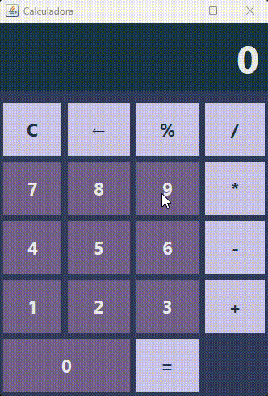

<h1 align="center">Calculadora</h1>

Calculadora feita em linguagem Java e utilizando bibliotecas Swing e AWT para personalização.

## 💻 Projeto

<div align="center">
  
</div>

Um pequeno projeto feito para testar conhecimentos em Java que realiza as operações básicas da matemática. A pequena parte do código abaixo mostra como é a lógica de cada operação:

```Java
switch (operador) {
            case "+" -> resultado = num1 + num2;
            case "-" -> resultado = num1 - num2;
            case "*" -> resultado = num1 * num2;
            case "/" -> resultado = num1 / num2;
            case "%" -> resultado = num1 * (num2 / 100);
        }
```

### 🎲 Rodando o código

```bash
# Clone este repositório
$ git clone https://github.com/nevaskab/Calculadora-Java.git

# Acesse a pasta do projeto no terminal/cmd
$ cd Calculadora-Java
```

Legal! Agora você tem uma cópia do projeto para modificar e testar no seu editor :D!

### Autor
---
<a>
<br />
<sub><b>Andressa Martins</b></sub></a>

Feito por Andressa Martins. Entre em contato <3.

<a href="mailto:andressa.devsystem@gmail.com"></a>
